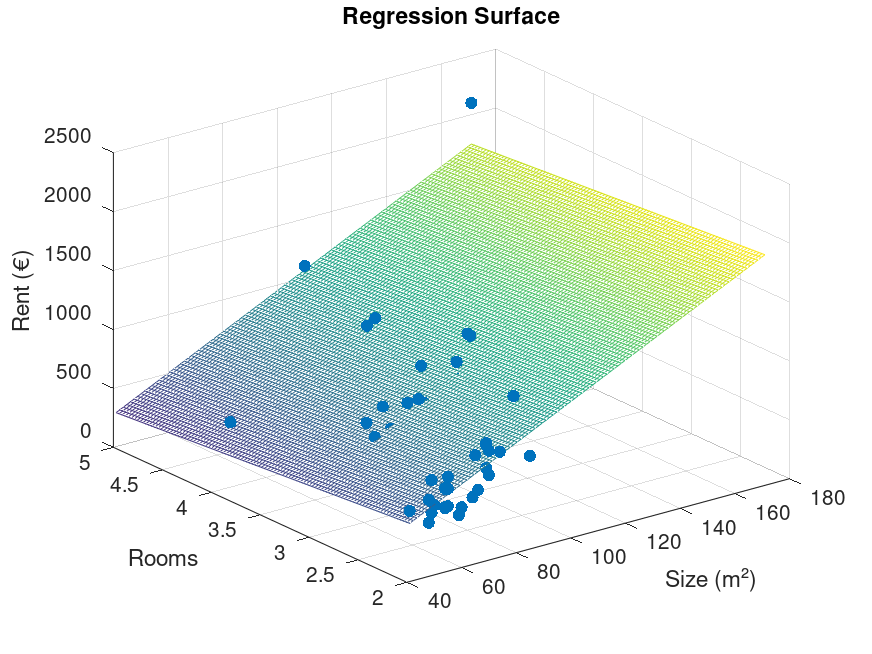

# 🏠 Rent Prediction in Stade, Germany - Octave Project

> This project is part of my transition from Mechanical Engineering to AI. 
> Developed as a first step into machine learning.

## 📋 Project Description
Octave implementation of linear regression to predict apartment rents based on:
- Apartment size (m²)
- Number of rooms

## ⚙️ How to Run
bash
# 1. Install Octave
sudo apt-get install octave  # Ubuntu/Debian

# 2. Clone repository
git clone https://github.com/Mohanned-Hamid/Stade-Rent-Prediction.git
cd Stade-Rent-Prediction

# 3. Run the project
octave Stade_multi_pred.m

## 📊 Sample Results

Predicted price for 68m², 2 rooms apartment:
  €797.97 (Gradient Descent)
  €797.99 (Normal Equations)
Mean Absolute Error: €137.62
R-squared: 0.6523

## 📂 Project Files
| File               |Description           |
|--------------------|----------------------|
| Stade_multi_pred.m | Main script          |
| Stade_data.txt     | Dataset (58 samples) |
| *.m                | Helper functions     |
| results/           | Output images        |

## 👨‍💻 Author
[Mohanned Hamid](https://www.linkedin.com/in/mohanned-hamid)
