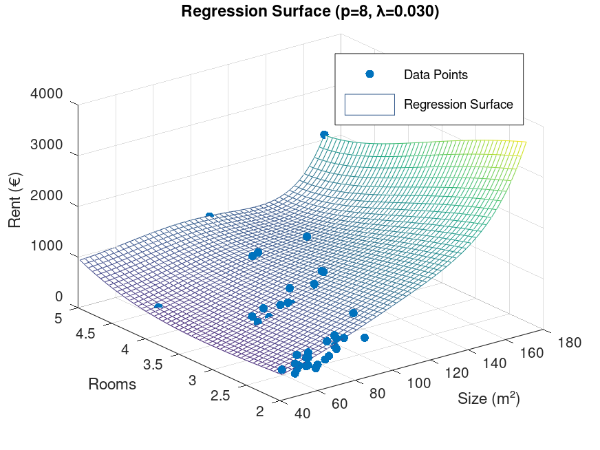

# My AI Learning Journey

## Rent Prediction Project

This project predicts apartment prices in Stade, Germany.

### Version 1 - Basic Model
- Simple linear regression
- Located in: versions/version1

### Version 2 - Improved Model
- Polynomial features
- Regularization
- Better accuracy
- Located in: versions/version2

## 📈 Performance Results

### Comparative Analysis
| Metric | Version 1 | Version 2 | Improvement |
|--------|-----------|-----------|-------------|
| Mean Absolute Error | €137.62 | €131.34 | 4.6% better |
| R-squared | 0.6523 | 0.8207 | 25.8% better |

### Key Findings
- Version 2 predicts rent prices with €131.34 average error
- Captures 82.07% of price variance (vs 65.23% in Version 1)
- Optimal complexity: 8th degree polynomial with λ=0.03 regularization

[View Detailed Results](RESULTS.md)

## 📸 Results Gallery

*Figure 1: Cost function convergence during training*

*Figure 2: 3D regression surface showing price relationships*

## 🎯 Quick Comparison

| Aspect | Version 1 | Version 2 |
|--------|-----------|-----------|
| **Algorithm** | Linear Regression | Polynomial Regression |
| **Features** | Size, Rooms | Polynomial features |
| **Regularization** | No | Yes (λ=0.03) |
| **MAE** | €137.62 | €131.34 |
| **R²** | 0.6523 | 0.8207 |
| **Best For** | Simple estimates | Accurate predictions |

## About Me
I'm a mechanical engineer learning AI step by step.